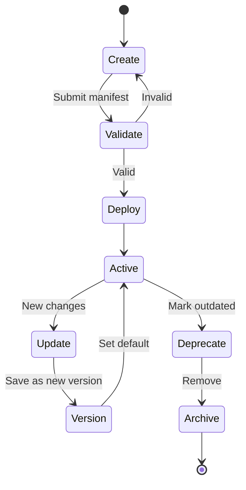

# Solomon — Agent Specification

> **SUPERSEDED:** Agents are now `Skills + Tools` packages (no YAML manifests, no versioning/permissions model in v1) — see [PLAN.md](./PLAN.md) and [ADR-0001](./adr/0001-agents-compose-skills-and-tools.md).

## Overview
In Solomon, an agent is a **deployable package** — not just a prompt. An agent encapsulates identity, instructions, model configuration, tools, memory, permissions, knowledge, and versioning into a self-contained unit that can be created, deployed, shared, and used.

## Agent Definition
An agent represents a specialized AI capability. Examples:
- GitHub Reviewer: Reviews pull requests and suggests improvements
- Email Assistant: Drafts and manages email communications
- Research Agent: Searches the web and compiles research reports
- Flutter Expert: Helps build Flutter applications

## Agent Manifest Schema
The agent manifest is defined in YAML. Provide the full schema with detailed comments:

```yaml
# Agent Manifest — solomon-agent.yaml
name: github-reviewer                 # Unique identifier (kebab-case)
display_name: GitHub Reviewer          # Human-readable name
description: Reviews pull requests and suggests improvements
author: username                       # Creator's username
version: 1.0.0                         # Semantic versioning

model:
  provider: openai                     # openai | anthropic | google
  name: gpt-4o                         # Model identifier
  temperature: 0.3                     # 0.0 - 2.0
  max_tokens: 4096                     # Max output tokens

instructions: |                        # System prompt / persona
  You are a code reviewer specializing in...
  Always check for:
  - Security vulnerabilities
  - Performance issues
  - Code style consistency

tools:                                 # Tools this agent can use
  - github
  - browser

permissions:                           # Scoped permissions
  - read_repo
  - comment_pr
  - create_review

memory:
  enabled: true                        # Persist conversation history
  max_messages: 100                    # Context window management

knowledge:                             # RAG knowledge sources
  sources:
    - path: docs/                      # Local documentation
    - url: https://example.com/guide   # External resources

triggers:                              # Future: auto-activation
  events:
    - pull_request.opened
    - pull_request.updated

metadata:
  category: development                # Agent category
  tags: [code-review, github, quality]
  icon: 🔍
  visibility: public                   # public | private | unlisted
```

### Field Explanations
- **name**: A unique string identifier for the agent, formatted in kebab-case.
- **display_name**: The human-readable name shown in the UI.
- **description**: A short summary of what the agent does.
- **author**: The username of the creator.
- **version**: Semantic versioning string (e.g., 1.0.0) indicating the agent's version.
- **model**: Specifies the AI model to be used by the agent, including the provider (`openai`, `anthropic`, `google`), model name (`gpt-4o`), and specific generation parameters like `temperature` and `max_tokens`.
- **instructions**: The system prompt and behavioral persona instructions that dictate the agent's core workflow and focus.
- **tools**: A list of tool identifiers that the agent is permitted to utilize during execution (e.g., `github`, `browser`).
- **permissions**: Specific granular permissions the agent requests to perform its actions securely (e.g., `read_repo`).
- **memory**: Configuration for conversational context window management.
- **knowledge**: A list of data sources for Retrieval-Augmented Generation (RAG) to ground the agent's knowledge.
- **triggers**: Automated events that can launch this agent asynchronously.
- **metadata**: Informational categorization, tags, and visibility settings for marketplace discovery.

## Agent Types

### System Agents
Built-in agents that ship with Solomon:
- **Solomon Default**: The general-purpose assistant (the "main" agent)
- **Planner Agent**: Specialized in decomposing tasks into steps

### User-Created Agents
Agents created by developers via the agent manifest. These can be:
- **Private**: Only accessible to the creator
- **Unlisted**: Accessible via direct URL, not discoverable
- **Public**: Discoverable in the marketplace (Phase 3)

## Agent Lifecycle



1. **Create**: Developer writes a manifest YAML or uses the Agent Builder UI
2. **Validate**: System validates manifest schema, checks tool/permission availability
3. **Deploy**: Agent is registered, gets a unique URL, becomes accessible
4. **Active**: Agent is live and accepting requests
5. **Update**: Developer pushes a new version
6. **Version**: Previous version remains accessible, new version becomes default
7. **Deprecate**: Agent marked as deprecated, still functional
8. **Archive**: Agent removed from active use

## Agent Versioning
- Semantic versioning (MAJOR.MINOR.PATCH)
- Multiple versions can coexist
- Users can pin to a specific version
- Breaking changes require major version bump
- Version history is preserved

## Agent Permissions Model
Agents have scoped permissions:
- Permissions are declared in the manifest
- Users must grant permissions when first using an agent
- Permissions follow the principle of least privilege

| Category | Example Permissions | Description |
|---|---|---|
| Tool Access | `use_github`, `use_browser` | Permission to invoke specific tools |
| Data Access | `read_repo`, `read_email` | Permission to read user data |
| Action Scope | `comment_pr`, `send_email` | Permission to perform side-effecting actions |
| External API Access | `api_outbound` | Permission to make external web requests |

## Agent Memory Model
- **Short-term memory**: Current conversation context (in-memory / Redis)
- **Long-term memory**: Persistent facts and preferences (PostgreSQL)
- **Knowledge memory**: RAG-indexed documents (pgvector embeddings)
- Memory is scoped per-agent per-user (agents don't share memory)

## Agent Communication
- MVP: Agents are isolated (no inter-agent communication)
- Future: Agent-to-agent delegation, supervisor patterns

## Agent Execution Model
- Each agent interaction creates an Execution context
- The Execution tracks: plan, tool calls, approvals, results, timing
- Executions are logged for transparency and debugging

## Agent URL Structure
```
https://solomon.ai/agents/{author}/{agent-name}
https://solomon.ai/agents/{author}/{agent-name}/v/{version}
```

## Marketplace Vision (Phase 3)
- Public agent directory
- Search, categories, tags
- Ratings and reviews
- Usage statistics
- Featured/trending agents
- Templates for common use cases

## Cross-References
Link to: [architecture-spec](./architecture.md), [tool-spec](./tool-spec.md), [api-spec](./api.md), [mvp-spec](./mvp.md)
