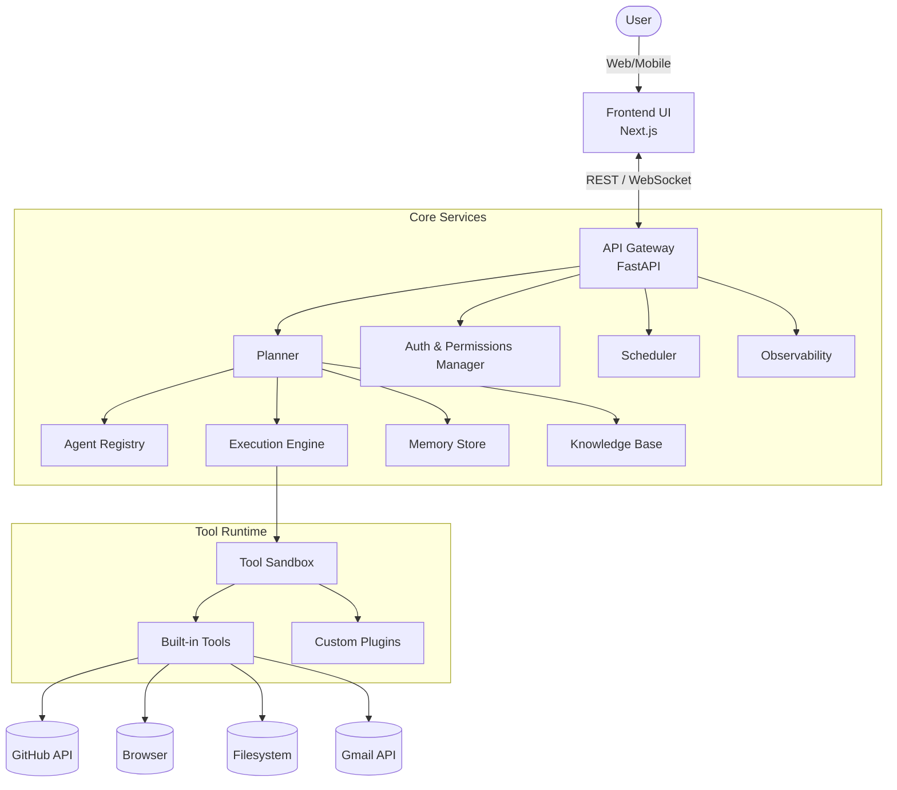
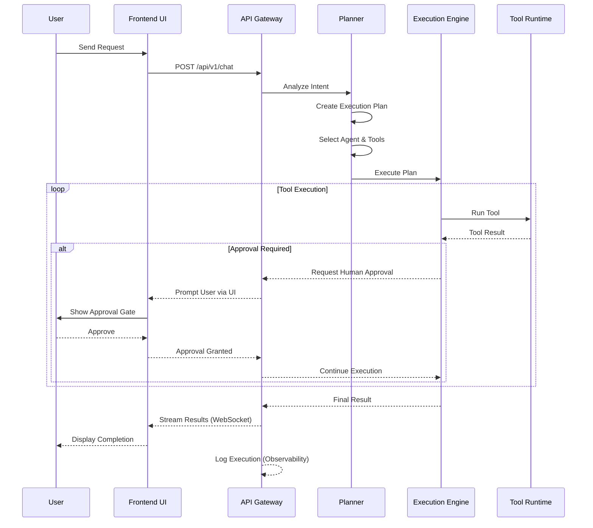

# Solomon — System Architecture

## Overview
Solomon's architecture is designed around a request lifecycle where user intent flows through planning, agent selection, tool execution, and result delivery. The system is built as a modular monorepo with clear separation between UI, API, core services, and tool runtime.

## High-Level Architecture



## Architecture Layers

### 1. UI Layer (apps/web)
- Next.js 16 + React 19 + Tailwind CSS 4 + shadcn/ui
- Chat interface, execution timeline, agent management UI
- Real-time updates via WebSocket
- Server-side rendering for public agent pages

### 2. API Layer (apps/api)
- FastAPI (Python)
- RESTful endpoints + WebSocket for streaming
- Authentication via Better Auth
- Rate limiting, request validation
- API versioning (/api/v1/)

### 3. Core Services
- **Planner** (packages/planner): Decomposes user requests into executable steps. Uses LLM to understand intent, create plans, and select appropriate agents/tools.
- **Agent Registry** (part of apps/api): Stores agent definitions, manages lifecycle (create, deploy, version, share). Agents stored as YAML manifests.
- **Execution Engine** (packages/tool-runtime): Orchestrates tool calls, manages execution state, handles retries and errors. Sandboxed execution.
- **Memory** (packages/memory): Conversation history, agent memory (short-term and long-term), context management. PostgreSQL for persistent, Redis for ephemeral.
- **Knowledge** (part of agent config): Per-agent document ingestion, embeddings, RAG pipeline for agent-specific knowledge.
- **Scheduler**: Future — handles deferred and recurring agent tasks.
- **Permission Manager**: Manages tool permissions, human approval gates, agent access scoping.
- **Observability**: Execution logging, metrics, tracing. Transparent execution timeline for users.

### 4. Tool Runtime
- Sandboxed execution environment for tools
- Tool interface contract (input schema, output schema, error handling)
- Built-in tools: GitHub, Browser, Filesystem, Gmail
- Plugin system for custom tools

## Request Lifecycle



## Data Architecture
- PostgreSQL schema overview: users, conversations, messages, agents, executions, tool_results, approvals
- Redis usage: session cache, execution state pub/sub, rate limiting
- Embedding storage for RAG (pgvector or similar)

## Repository Structure

```
solomon/
├── apps/
│   ├── web/          # Next.js frontend application
│   └── api/          # FastAPI backend service
├── packages/
│   ├── planner/      # Task planning engine and LLM orchestration
│   ├── agent-sdk/    # Agent development SDK for Creators
│   ├── tool-runtime/ # Sandboxed tool execution engine
│   ├── memory/       # Conversation & agent memory management
│   └── shared/       # Shared types, schemas, and utilities
├── agents/           # Built-in agent definitions (YAML)
├── tools/            # Built-in tool implementations
├── docs/             # Specification documents
└── examples/         # Example agents and integration templates
```

## Infrastructure
- Docker for local development and deployment
- Vercel for frontend (apps/web)
- Railway/Fly.io for backend (apps/api)
- PostgreSQL (managed) + Redis (managed)
- Environment configuration strategy

## Authentication Architecture
- Better Auth integration
- Session-based auth for web UI
- API key auth for programmatic access
- OAuth for third-party tool connections (GitHub, Gmail)

## Technology Decisions

| Decision | Choice | Rationale | Alternatives Considered |
|---|---|---|---|
| Frontend Framework | Next.js 16 | Excellent SSR, ecosystem, Vercel integration | React SPA, Vue/Nuxt |
| UI Components | React 19 + shadcn/ui | Unstyled, accessible, tailwind-ready | MUI, Chakra UI |
| Backend Framework | FastAPI (Python) | High perf, native async, Python AI ecosystem | Express/Node, Django |
| Database | PostgreSQL | Relational integrity, scalable, pgvector | MongoDB, MySQL |
| Cache/PubSub | Redis | Fast ephemeral store, pub/sub for WebSockets | RabbitMQ, Kafka |
| Auth Provider | Better Auth | Flexible, open-source, Next.js friendly | NextAuth, Clerk |

## Cross-References
- [vision.md](./vision.md)
- [agent-spec.md](./agent-spec.md)
- [tool-spec.md](./tool-spec.md)
- [api.md](./api.md)
- [mvp.md](./mvp.md)
