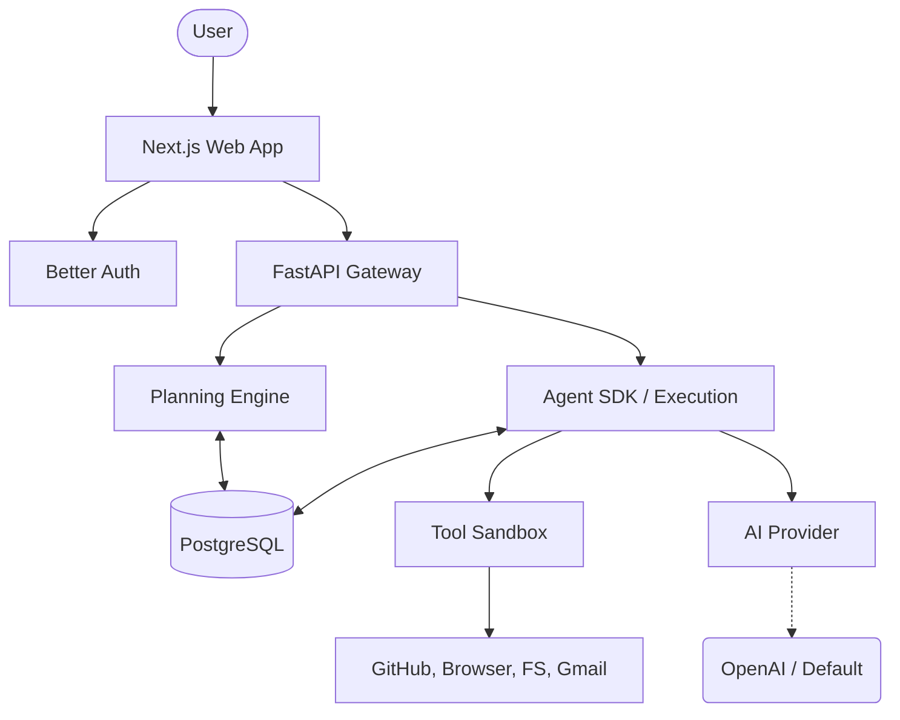

# Solomon — MVP Specification

> **SUPERSEDED:** Describes the pre-pivot platform (filesystem tools, agent manifests, marketplace). The current objective lives in [PLAN.md](./PLAN.md); canonical language in [CONTEXT.md](../CONTEXT.md).

## Objective
Prove the core idea: an AI that can plan and execute digital tasks on behalf of users, with human oversight. The MVP should demonstrate end-to-end task completion across at least 2 tool categories.

## MVP Scope

### In Scope ✅

#### Core Platform
- User authentication (sign up, sign in, session management)
- Chat interface (send messages, view responses, conversation history)
- Planner (decompose user requests into steps)
- Execution engine (run tools, manage state)
- Human approval (approve/reject irreversible actions)
- Execution transparency (real-time timeline of what Solomon is doing)

#### Tools
- **GitHub**: Read repositories, list PRs, read diffs, create PRs, post comments
- **Browser**: Navigate URLs, extract page content, search the web
- **Filesystem**: Read files, write files, list directories
- **Gmail**: Read emails, draft emails, send emails (with approval)

#### Agent Platform (basic)
- Create agent (YAML manifest)
- Deploy agent (make it accessible via URL)
- Share agent (public URL)
- Use agent (interact via chat UI)

#### Observability
- Execution timeline (step-by-step progress)
- Execution logs (detailed tool call logs)
- Basic conversation memory (within session + persisted)

### Out of Scope ❌
- Multi-agent swarms / agent-to-agent communication
- Voice assistant
- Mobile applications
- Billing / payments
- Enterprise SSO
- Fine-tuning models
- Visual workflow builders
- Autonomous scheduling (cron-style)
- Marketplace (ratings, categories, search)
- Team/organization features
- Analytics dashboard

## User Stories
- As a user, I can sign up and start a conversation with Solomon.
- As a user, I can ask Solomon to read a GitHub repo and summarize recent PRs.
- As a user, I can ask Solomon to draft and send an email (with my approval).
- As a user, I can see exactly what Solomon is doing step by step.
- As a developer, I can create an agent with a YAML manifest.
- As a developer, I can deploy my agent and get a shareable URL.
- As a user, I can interact with a deployed agent via its URL.

## Success Criteria
- A user can complete a multi-step task (e.g., "Read my latest GitHub PR and send a summary email") end-to-end.
- Human approval gate blocks irreversible actions (email send, PR creation) until user confirms.
- Execution timeline shows real-time progress with ≤2 second latency.
- A developer can create, deploy, and share an agent in under 5 minutes.
- Chat interface supports streaming responses.
- System handles tool errors gracefully (retry, fallback, clear error message).

## Technical Requirements
- Response streaming via WebSocket.
- Tool execution timeout: 30 seconds per tool call.
- Conversation context window management.
- Graceful degradation when AI provider is unavailable.
- Local development with Docker Compose.

## MVP Architecture
Below is a simplified architecture diagram for the MVP version of Solomon. Reference [architecture.md](./architecture.md) for the full architecture.

## Milestones
1. **Foundation**: Auth + Chat + basic Planner (no tools).
2. **Tool Execution**: Add GitHub + Filesystem tools, execution engine, approval flow.
3. **Full MVP**: Add Browser + Gmail tools, execution timeline, basic memory.
4. **Agent Platform**: Agent creation, deployment, sharing.

## Cross-References
- [Architecture Spec](./architecture.md)
- [Agent Spec](./agent-spec.md)
- [Tool Spec](./tool-spec.md)
- [API Design](./api.md)
- [Roadmap](./roadmap.md)
