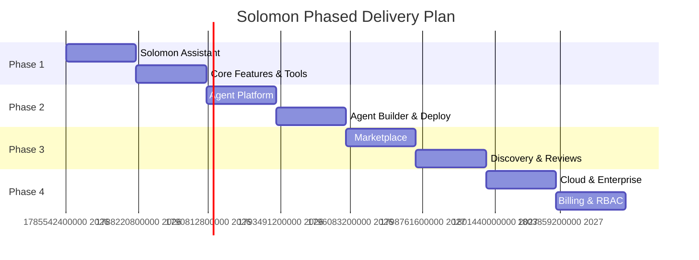

# Solomon — Roadmap

## Overview
Solomon is built in four progressive phases, each expanding the platform's capabilities while maintaining a working, deployable product at every phase boundary.

## Phase 1 — Solomon Assistant

### Goal
Build an AI capable of completing digital tasks with human oversight. Prove the core concept: users request tasks, Solomon plans and executes them.

### Key Features
- Authentication (sign up, sign in, sessions)
- Chat interface (streaming responses, conversation history)
- Planner (intent understanding, step decomposition)
- Tool execution engine (sandboxed, with retries)
- Human approval flow (for irreversible actions)
- Execution transparency (real-time step timeline)
- 4 MVP tools: GitHub, Browser, Filesystem, Gmail
- Basic conversation memory

### Success Criteria
- A user can complete a multi-step task end-to-end (e.g., "Read my latest PR and email me a summary")
- Human approval blocks irreversible actions until confirmed
- Execution timeline shows real-time progress
- System handles tool errors gracefully

### Estimated Scope
- Frontend: Chat UI, execution timeline, approval dialogs
- Backend: Auth, Planner, Execution engine, Tool runtime, 4 tools
- Infrastructure: Docker Compose for local dev, basic deployment

---

## Phase 2 — Agent Platform

### Goal
Allow developers to create, deploy, and share specialized AI agents. Transform Solomon from a single assistant into a platform.

### Key Features
- Agent Builder UI (visual manifest editor)
- Agent manifest validation and schema
- Agent deployment (register, get URL)
- Public agent URLs (`solomon.ai/agents/author/agent-name`)
- Agent versioning (semantic versioning, version history)
- Agent-specific memory and knowledge (RAG)
- Agent permissions system
- Agent SDK (Python package for creating agents programmatically)

### Success Criteria
- A developer can create an agent via YAML manifest or UI in under 5 minutes
- A deployed agent is accessible via a stable public URL
- Agents can have custom knowledge bases via RAG
- Agent updates don't break existing users (versioning)

### Estimated Scope
- Frontend: Agent builder UI, agent gallery, agent detail pages
- Backend: Agent CRUD, deployment pipeline, knowledge/RAG, SDK
- Infrastructure: CDN for agent pages, knowledge storage

### Migration Notes
- No breaking changes from Phase 1
- Existing Solomon Assistant becomes the "default" system agent
- All Phase 1 features continue to work

---

## Phase 3 — Marketplace

### Goal
Build an ecosystem where developers publish agents and users discover and use them. Think App Store for AI agents.

### Key Features
- Public agent marketplace / directory
- Search, categories, tags
- Agent ratings and reviews
- Agent templates (start from a template instead of scratch)
- Featured / trending agents
- Agent usage statistics (public)
- Developer profiles
- Agent collections / lists

### Success Criteria
- Users can discover relevant agents through search and categories
- Agents have public usage metrics and ratings
- Templates reduce agent creation time by 50%
- At least 5 categories with 3+ agents each

### Estimated Scope
- Frontend: Marketplace UI, search, categories, reviews, developer profiles
- Backend: Search index, rating system, template engine, usage analytics
- Infrastructure: Search infrastructure (e.g., Meilisearch)

### Migration Notes
- Existing deployed agents become listable in marketplace
- Private/unlisted agents remain unchanged
- New metadata fields added to agent manifest (optional, backward-compatible)

---

## Phase 4 — Cloud

### Goal
Scale Solomon for teams and organizations. Add the business infrastructure needed for commercial adoption.

### Key Features
- Organizations and teams
- Role-based access control (admin, developer, user)
- Billing and subscription management
- Usage-based pricing
- API key management with scoped permissions
- Analytics dashboard (usage, costs, performance)
- Enterprise SSO (SAML, OIDC)
- Audit logging
- SLA and support tiers
- Custom model deployment (bring your own API key, or use Solomon's)

### Success Criteria
- Teams can collaborate on agents within an organization
- Billing accurately tracks and charges for usage
- Enterprise customers can use SSO for authentication
- Audit logs capture all agent activities for compliance

### Estimated Scope
- Frontend: Org dashboard, team management, billing, analytics
- Backend: Multi-tenancy, billing integration (Stripe), RBAC, audit system
- Infrastructure: Multi-region deployment, enhanced monitoring

### Migration Notes
- Individual accounts become the foundation for org membership
- Free tier remains available
- API keys gain organization-level scoping

---

## Cross-Phase Concerns

### Security
- Phase 1: Basic auth, input validation, tool sandboxing
- Phase 2: Agent permission scoping, knowledge access control
- Phase 3: Review moderation, spam prevention
- Phase 4: Enterprise security, audit logging, compliance

### Performance
- Phase 1: Single-user performance targets
- Phase 2: Multi-agent concurrent execution
- Phase 3: Search and discovery performance
- Phase 4: Multi-tenant scaling, rate limiting per org

### Breaking Changes Policy
- API versioning from Phase 1 (`/api/v1/`)
- Deprecation notices at least 1 phase in advance
- Migration guides for any breaking changes
- Backward-compatible additions preferred over breaking changes

## Cross-References
Link to: [vision.md](./vision.md), [architecture.md](./architecture.md), [mvp.md](./mvp.md), [agent-spec.md](./agent-spec.md), [tool-spec.md](./tool-spec.md), [api.md](./api.md)
