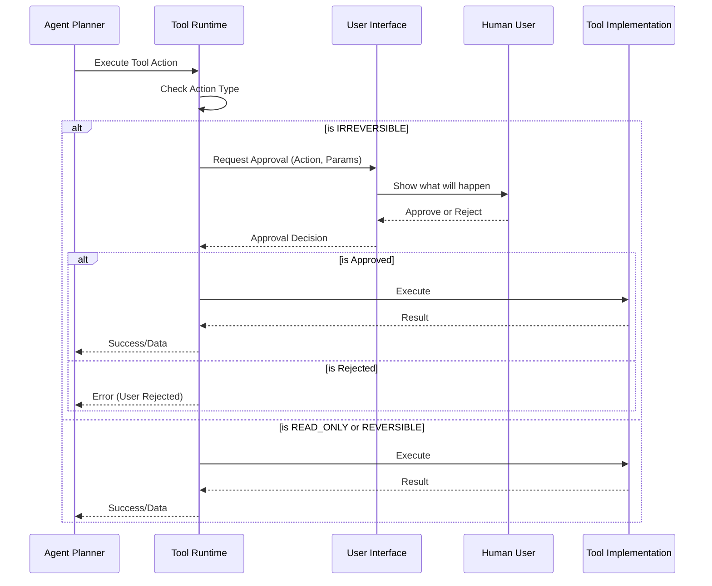

# Solomon — Tool Specification

> **SUPERSEDED:** Tool set changed (no filesystem/GitHub in v1; search/browse/gmail/code-review instead) — see [PLAN.md](./PLAN.md). The `BaseTool` contract and approval-gate model below still hold.

## Overview
Tools are the hands and eyes of Solomon. They are the mechanism by which agents interact with the outside world — reading data, performing actions, and producing results. Every new capability should be added as a Tool. Never hardcode features into Solomon.

## Design Philosophy
- Tools are atomic capabilities (one tool = one category of actions)
- Tools have explicit input/output contracts
- Tools declare their permission requirements
- Tools distinguish between reversible and irreversible actions
- Tools are sandboxed and isolated

## Tool Interface Contract
Every tool implements the same base interface.

```python
from abc import ABC, abstractmethod
from pydantic import BaseModel
from typing import Any
from enum import Enum

class ToolAction(str, Enum):
    REVERSIBLE = "reversible"
    IRREVERSIBLE = "irreversible"  # Requires human approval
    READ_ONLY = "read_only"

class ToolInput(BaseModel):
    action: str              # The specific action to perform
    parameters: dict[str, Any]  # Action-specific parameters

class ToolOutput(BaseModel):
    success: bool
    data: Any | None = None
    error: str | None = None
    metadata: dict[str, Any] = {}

class ToolDefinition(BaseModel):
    name: str
    description: str
    actions: list[dict]      # Available actions with schemas
    permissions: list[str]   # Required permissions
    
class BaseTool(ABC):
    @abstractmethod
    def definition(self) -> ToolDefinition:
        """Return tool metadata and action schemas."""
        ...
    
    @abstractmethod
    async def execute(self, input: ToolInput) -> ToolOutput:
        """Execute a tool action."""
        ...
    
    @abstractmethod
    def action_type(self, action: str) -> ToolAction:
        """Classify action as reversible, irreversible, or read-only."""
        ...
```

## Tool Registry
- Tools are registered at startup
- Each tool provides its definition (name, description, available actions, parameter schemas)
- The Planner uses tool definitions to select appropriate tools
- Tools can be enabled/disabled per-agent via the agent manifest

## MVP Tools

### 1. GitHub Tool
- **Actions**: list_repos, get_repo, list_pulls, get_pull, get_diff, create_pull, comment_pull, create_review, list_issues, get_issue, create_issue
- **Permissions**: read_repo, write_repo, comment_pr, create_pr
- **Auth**: OAuth (GitHub App or Personal Access Token)
- **Action types**: read_only for list/get, irreversible for create/comment

Example action schema for `create_pull`:
```json
{
  "action": "create_pull",
  "description": "Create a new pull request in a repository.",
  "parameters": {
    "owner": {"type": "string", "description": "Repository owner"},
    "repo": {"type": "string", "description": "Repository name"},
    "title": {"type": "string", "description": "Title of the pull request"},
    "head": {"type": "string", "description": "The name of the branch where your changes are implemented."},
    "base": {"type": "string", "description": "The name of the branch you want the changes pulled into."},
    "body": {"type": "string", "description": "The contents of the pull request."}
  }
}
```

### 2. Browser Tool
- **Actions**: navigate, extract_content, search, screenshot, click, fill_form
- **Permissions**: browse_web
- **Action types**: All read_only (browsing doesn't modify external state)
- Note: Uses headless browser (Playwright/Puppeteer)

Example action schema for `search`:
```json
{
  "action": "search",
  "description": "Perform a web search using a search engine.",
  "parameters": {
    "query": {"type": "string", "description": "The search query string"}
  }
}
```

### 3. Filesystem Tool
- **Actions**: read_file, write_file, list_directory, create_directory, delete_file, search_files
- **Permissions**: read_fs, write_fs
- **Action types**: read_only for read/list/search, irreversible for write/delete
- Note: Scoped to user's workspace, never system files

Example action schema for `write_file`:
```json
{
  "action": "write_file",
  "description": "Write content to a file in the workspace.",
  "parameters": {
    "path": {"type": "string", "description": "Relative path to the file"},
    "content": {"type": "string", "description": "Content to write to the file"},
    "overwrite": {"type": "boolean", "description": "Whether to overwrite if file exists"}
  }
}
```

### 4. Gmail Tool
- **Actions**: list_emails, read_email, draft_email, send_email, reply_email, search_emails
- **Permissions**: read_email, send_email
- **Auth**: OAuth (Google API)
- **Action types**: read_only for list/read/search, reversible for draft, irreversible for send/reply

Example action schema for `send_email`:
```json
{
  "action": "send_email",
  "description": "Send an email.",
  "parameters": {
    "to": {"type": "array", "items": {"type": "string"}, "description": "List of recipient email addresses"},
    "subject": {"type": "string", "description": "Email subject"},
    "body": {"type": "string", "description": "Email body (plain text or HTML)"}
  }
}
```

## Tool Permission Model
- Permissions are declared by the tool and requested by the agent
- Users grant permissions on first use
- Permissions can be revoked at any time
- Granular scoping (e.g., `read_repo:owner/repo` not just `read_repo`)

| Tool | Required Permissions |
|------|----------------------|
| GitHub | read_repo, write_repo, comment_pr, create_pr |
| Browser | browse_web |
| Filesystem | read_fs, write_fs |
| Gmail | read_email, send_email |

## Tool Execution Model
- Tools execute within the Tool Runtime (`packages/tool-runtime`)
- Each tool call has a timeout (default: 30 seconds)
- Failed tool calls return structured errors
- Retry policy: up to 2 retries for transient errors
- Execution is sandboxed (tools cannot access other tools' state)

### Sync vs Async Execution
- Most tool calls are async (non-blocking)
- Results are streamed back via WebSocket
- Long-running tools (e.g., browser navigation) support progress updates

## Human Approval Integration



## Creating Custom Tools
Developers who want to add new tools can follow these steps:
1. Create a new Python module in `tools/`
2. Extend `BaseTool`
3. Implement `definition()`, `execute()`, `action_type()`
4. Register the tool in the tool registry
5. Add tool permissions to the permission system
6. Write tests

Here is a minimal example of a custom tool:
```python
from tools.base import BaseTool, ToolDefinition, ToolInput, ToolOutput, ToolAction

class CalculatorTool(BaseTool):
    def definition(self) -> ToolDefinition:
        return ToolDefinition(
            name="Calculator",
            description="Performs basic mathematical operations.",
            actions=[
                {
                    "action": "add",
                    "description": "Add two numbers.",
                    "parameters": {
                        "a": {"type": "number"},
                        "b": {"type": "number"}
                    }
                }
            ],
            permissions=[]
        )
    
    async def execute(self, input: ToolInput) -> ToolOutput:
        if input.action == "add":
            result = input.parameters["a"] + input.parameters["b"]
            return ToolOutput(success=True, data={"result": result})
        return ToolOutput(success=False, error="Unknown action")
        
    def action_type(self, action: str) -> ToolAction:
        return ToolAction.READ_ONLY
```

## Future Tool Categories
- Calendar (Google Calendar, Outlook)
- Database (PostgreSQL, MongoDB queries)
- REST API (generic HTTP client)
- Slack (messages, channels)
- Jira (tickets, sprints)
- Cloud (AWS, GCP, Azure management)

## Cross-References
- [architecture.md](./architecture.md)
- [agent-spec.md](./agent-spec.md)
- [api.md](./api.md)
- [mvp.md](./mvp.md)
