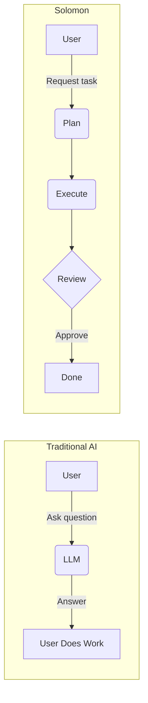
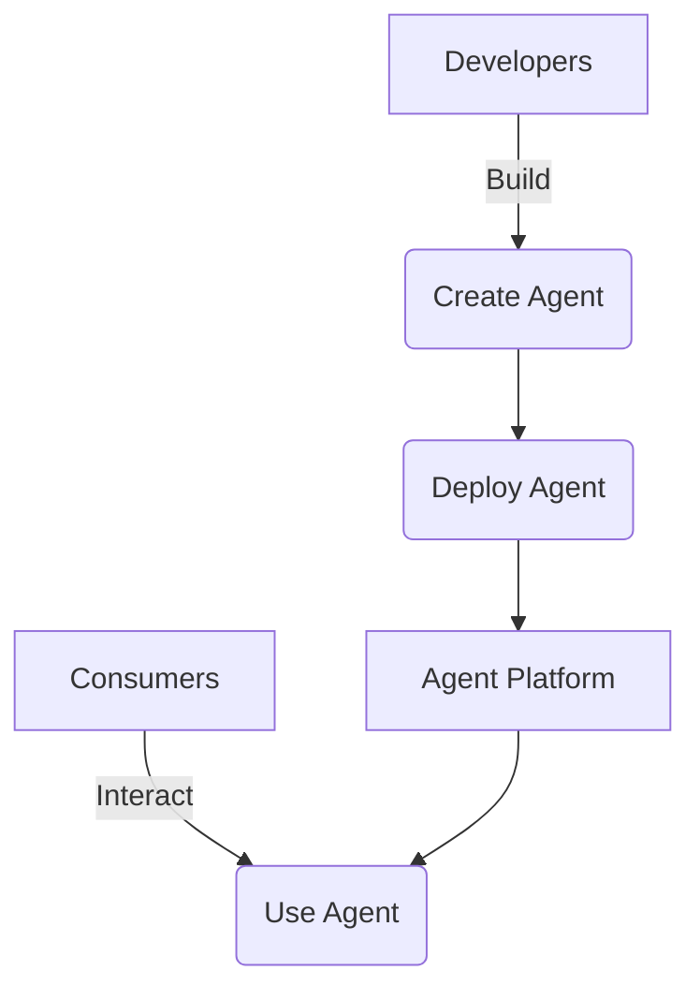

# Solomon — Product Vision

> **SUPERSEDED:** Describes the pre-pivot platform (filesystem tools, agent manifests, marketplace). The current objective lives in [PLAN.md](./PLAN.md); canonical language in [CONTEXT.md](../CONTEXT.md).

## The Problem

Today's AI mostly answers questions. While Large Language Models are incredibly powerful at understanding intent and generating text, users still have to do the heavy lifting. They have to copy-paste responses, switch apps, open websites, execute commands, and repeat manual steps to actually achieve their goals. AI assistants are excellent at generating answers but poor at completing real work. 

## The Vision

Solomon goes beyond Q&A. Instead of telling users *how* to do something, Solomon helps them **complete the task**.

## Core Philosophy

- **Conversation is the interface.** Users interact through natural language, the most intuitive way to express intent.
- **Execution is the product.** The value is measured by: "How much work did Solomon finish today?"
- **Action over Conversation.** The goal is finishing work, not just generating text.
- **Transparency.** Always show what Solomon is doing, which tools are used, and what happens next.
- **Human Control.** Never perform important actions without permission. Trust > automation.
- **Extensibility.** Every new capability is added as a Tool or Agent. Never hardcode features.
- **Open Source First.** Useful as open-source before becoming commercial SaaS.

## Target Users

### Consumers
People who want AI to perform tasks. They say "Send this email" not "How do I send an email?".

**Example Flow:**
1. User: "Draft an email to the team about the launch."
2. Solomon: Draft created.
3. Solomon: Preview shown to user.
4. User: Approve.
5. Solomon: Email sent.

### Creators
Developers who build specialized AI agents for others. They create an agent (e.g., GitHub Reviewer), deploy it, and share a URL so anyone can use it.

## Platform Vision

Solomon is both an AI Assistant AND an Agent Platform.

Developers create agents. Users consume agents.

## What Solomon Is

Solomon is an AI Operating System. Rather than being another chatbot, it acts like a digital coworker embedded in your workflow.

## North Star

> Solomon is an open-source AI Operating System that helps people complete digital work. Developers can build and deploy specialized AI agents, while users interact with a single intelligent assistant capable of planning, executing, and completing real-world tasks.

## Future Vision

Imagine asking Solomon to prepare your weekly engineering report. It automatically reads GitHub activity, reads Jira tickets, summarizes Slack discussions, generates a report, creates a PDF, drafts an email, waits for approval, and sends it. The user doesn't think about prompts, tools, or agents. They simply ask. Solomon gets the work done.

### Example Scenarios

- **"Deploy my app to production"**
  Solomon runs tests, builds the application, deploys it to the server, verifies the deployment is successful, and reports back.

- **"Review this PR"**
  Solomon reads the diff, checks for structural issues or bugs, suggests improvements, and posts comments directly on GitHub.

- **"Research competitors in the AI agent space"**
  Solomon searches the web, reads articles, compiles a structured report of the top competitors, and saves it as a document.
